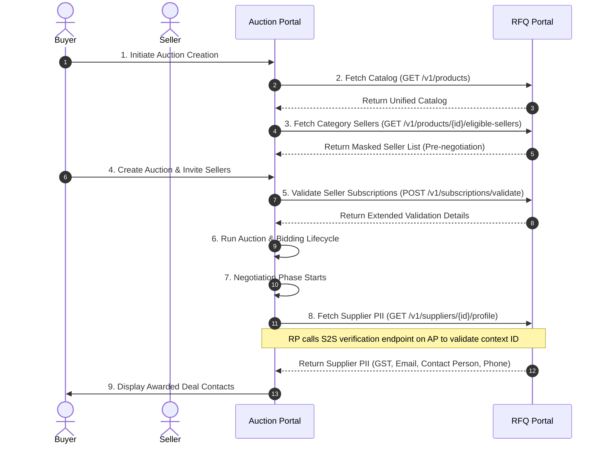

# RFQ ↔ Auction Portal Integration Testing Guide

This guide details the step-by-step integration testing flow between the RFQ Portal and the Auction Portal. Follow these steps to verify catalog searching, seller validation, bidding qualification, and secure profile disclosure.

---

## E2E Integration Testing Steps



### Step 1: Login & Authentication
First, the AP developer logs in to get a session cookie (`auth_token`).
*   **Request:** `POST /api/auth/login`
*   **Body:**
    ```json
    {
      "email": "buyer.premium1@test.com",
      "password": "Buyer@123"
    }
    ```
*   **Response:** Sets the `auth_token` cookie. Postman automatically attaches this cookie on subsequent requests.

---

### Step 2: Search and Load Master Product Catalog
AP queries the unified product catalog from the RFQ Portal.
*   **Request:** `GET /api/v1/products?q=iPhone&page=1&limit=5&sortBy=price&sortOrder=desc`
*   **Response:**
    ```json
    {
      "success": true,
      "message": "Products retrieved successfully.",
      "data": [
        {
          "productId": "02a41116-13b7-4b31-bf6a-30451f5e8f53",
          "productName": "Apple iPhone 15 Pro — Smartphones",
          "sku": "E2E-MOB-002",
          "brand": "Apple",
          "category": "Electronics",
          "subcategory": "Smartphones",
          "uom": "PCS",
          "moq": 2,
          "price": 119900,
          "images": ["https://picsum.photos/seed/e2e-e2e-mob-002/700/700"],
          "isActive": true,
          "specifications": "..."
        }
      ],
      "meta": {
        "pagination": { "page": 1, "limit": 5, "total": 2, "totalPages": 1 }
      },
      "errors": null
    }
    ```

---

### Step 3: Fetch Eligible Sellers for the Product (Pre-negotiation)
To display suppliers capable of bidding on the selected product, AP calls the mapped sellers endpoint. Real supplier names and details are masked.
*   **Request:** `GET /api/v1/products/{productId}/eligible-sellers`
*   **Response:**
    ```json
    {
      "success": true,
      "message": "Eligible sellers for product retrieved successfully.",
      "data": [
        {
          "supplierId": "5ddb17da-c0e0-4271-81d0-0c19d531d0bb",
          "companyId": "5ddb17da-c0e0-4271-81d0-0c19d531d0bb",
          "city": "Bengaluru",
          "verificationStatus": "VERIFIED",
          "rating": 4.9,
          "companyLogo": null
        }
      ],
      "meta": null,
      "errors": null
    }
    ```

---

### Step 4: Validate Subscriptions Prior to Bidding
When the Auction is active, AP validates the bidder's subscription state to check if they are authorized to place bids.
*   **Request:** `POST /api/v1/subscriptions/validate`
*   **Body:**
    ```json
    {
      "userId": "5ddb17da-c0e0-4271-81d0-0c19d531d0bb",
      "requiredType": "SELLER"
    }
    ```
*   **Response:**
    ```json
    {
      "success": true,
      "message": "Subscription validation completed.",
      "data": {
        "userId": "5ddb17da-c0e0-4271-81d0-0c19d531d0bb",
        "buyerSubscription": { "status": "INACTIVE", "plan": null, "activatedAt": null },
        "sellerSubscription": { "status": "ACTIVE", "plan": "SELLER_LIFETIME", "activatedAt": "2026-01-01T00:00:00.000Z" },
        "status": "ACTIVE",
        "planType": "SELLER",
        "startDate": "2026-01-01T00:00:00.000Z",
        "expiryDate": null,
        "isExpired": false
      },
      "meta": null,
      "errors": null
    }
    ```

---

### Step 5: Retrieve Supplier Profile (Post-Negotiation PII Release)
Once negotiation starts or a deal is awarded, AP requests the supplier's contact details. This endpoint verifies the negotiation context ID and the buyer ID before releasing PII.
*   **Request:** `GET /api/v1/suppliers/{supplierId}/profile`
*   **Headers:**
    *   `X-Auction-Context-Id`: `a7c234a9-83bc-42fe-bd12-f04b1239aa82`
*   **Response:**
    ```json
    {
      "success": true,
      "message": "Supplier profile details fetched successfully.",
      "data": {
        "companyName": "Premium Automation Seller",
        "contactPerson": "SELLER.PREMIUM1",
        "phone": "9876520002",
        "email": "seller.premium1@test.com",
        "gst": "27AAAAA5DDB17D1111A1Z1",
        "address": {
          "street": "12, Automation Hub",
          "city": "Bengaluru",
          "state": "Karnataka",
          "zipCode": "560001",
          "country": "India"
        }
      },
      "meta": null,
      "errors": null
    }
    ```
